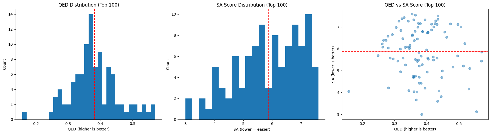
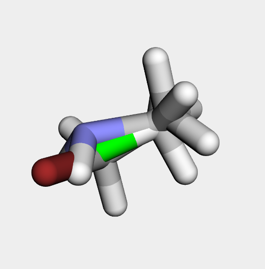

# Graph-Based Molecule Design with an Autoregressive VAE

This project implements a deep learning model for the **design and generation of novel molecules** with valid chemical structures. The core approach is based on representing molecules as **graphs** and utilizing an **Autoregressive Variational Autoencoder (VAE)** architecture built upon Graph Neural Networks (GNNs).

## 🎯 Project Goal

The primary objective is to build a model that can learn the chemical space of molecules active against a specific biological target (EGFR, from the ChEMBL database). The model then samples from the learned latent space to generate novel molecules with desirable properties, such as drug-likeness and synthetic accessibility.

***

## 📊 Key Results

The final model was trained for **20 epochs** on a subset of **4096 molecules** from the main dataset. After training, the model was used to generate a large batch of new candidates. The top 50 molecules were selected and analyzed based on a combined score of **QED (Quantitative Estimation of Drug-likeness)** and **SA Score (Synthetic Accessibility Score)**.

### Statistical Analysis of Top Molecules

The following plots show the distribution of QED and SA Score for the top 50 molecules generated by the model.

### Best Generated Molecule Example

Below is the 3D structure of one of the best-performing molecules generated by the model, selected for its high combined score.

*(You can place the 3D image and SMILES string of your best molecule here.)*

**SMILES:** `[SMILES string of your best molecule here]`

***

## 🛠️ Model Architecture

The model consists of a Variational Autoencoder (VAE) structure:

* **Encoder:** A **Graph Attention Network (GAT)** that compresses the input molecular graph into a dense latent vector.
* **Decoder:** An **Autoregressive** model that constructs the molecule step-by-step (atom-by-atom and bond-by-bond) from the latent vector. This approach allows the model to generate complex and chemically valid structures with higher precision.

### Development Process & Challenges

Throughout the development, the model faced several challenges:
1.  **Initial Models:** Simpler models were unable to generate valid molecules and consistently produced valence errors.
2.  **Graph Monsters:** After adding valence constraints, the model produced valid but structurally unrealistic and overly complex molecules.
3.  **Atomic Soup:** By improving the architecture to predict bond types, the model became too conservative and generated disconnected fragments.
4.  **Final Model:** By implementing a "smart" generation script (combining forced connectivity with valence checking), the final model was able to produce connected and valid molecules.

***

## 🚀 How to Use

### Prerequisites
To run this project, you will need the following libraries:
- `torch` & `torchvision`
- `torch_geometric`
- `rdkit-pypi`
- `pandas`
- `tqdm`
- `matplotlib`
- `py3Dmol` (for 3D visualization)

### Running the Project
1.  **Process Data:** First, run the script to download data from ChEMBL and convert it into a graph format.
2.  **Train the Model:** Run the training script. The script supports **checkpointing**, allowing you to resume training in multiple sessions.
3.  **Generate Molecules:** After training, use the generation script to create new molecules with the saved model.

***

## 🔮 Future Work

This project provides a solid foundation for future research. The next steps could include:

* **Large-Scale Training:** Training the model on the full ChEMBL dataset to learn more diverse chemical patterns.
* **Extended Training:** Continuing the training of the current model for more epochs to achieve full convergence and improve the quality of generated molecules.
* **Reinforcement Learning (RL):** Implementing an RL loop for **goal-directed optimization**. A reward function can be defined based on specific criteria (e.g., docking score against a target protein, QED, or SA Score) to fine-tune the model to generate molecules with desired properties.
